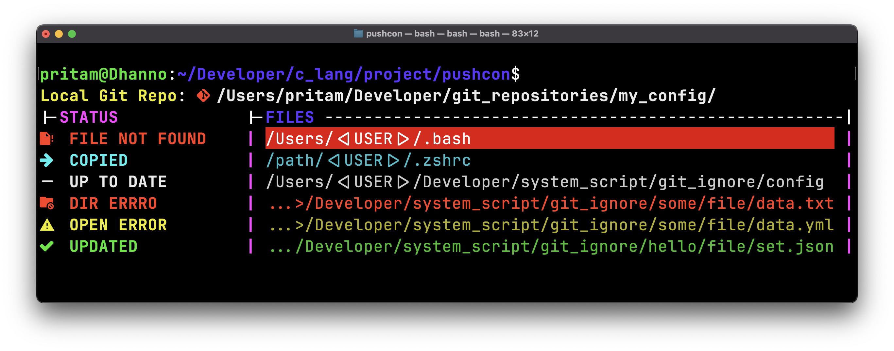

<h1>
	Push System Configuration To Github
</h1>

<h2>
	Push config to github is a CLI tool written in C language. This project designed to identify and synchronize
	differences between two files. This tool is particularly useful for users who need to ensure data consistency
	between versions of files, whether they are documents, code files.
</h2>

<h3>
	Features
</h3>

<ul>
	<li>
		Project allow you to set a target file of your configuration and get depository on your local machine to
		synchronise both file in between them
	</li>
</ul>

<h1>
	Basic idea behind this project.
</h1>

<h3 align="center">
	<a href="">
		
	</a>
</h3>

<h2>License</h2>
<a href="./LICENSE">MIT License</a>


``` sh
# Local git repo path in which you wants to sync your files.
# Example: Syncing files to the 'my_config' repository on GitHub
export COMP_GIT_SOURCE_DIR="/home/pritam/Desktop/programming/git_repositories/my_config/"
```

<h2>
	YAML Configuration
</h2>

The YAML configuration file should have the following structure and name `pathData.txt`:

<h3 align="center">
	<a href="">
		
	</a>
</h3>

``` c
{
	.fileName = ".bashrc",

	// The folder path where the original file is located.
	// Example: The '.bashrc' file is located in the '/home/pritam/' directory.
	.systemDirectory = "/home/pritam/",

	// The folder path inside the local git repo where you want to sync the file.
	// Example: The '.bashrc' file will be synced to the 'linux_ubuntu/' folder.
	.gitDir = "dirwin_os/",


	// The new name for the file inside the git repo.
	// Example: The '.bashrc' file will be renamed to 'bashrc.sh' in the git repo.
	.newName = "bashrc.sh",
},
```

``` c
{
	.fileName = ".bashrc",
	.systemDirectory = "home/pritam/",
	.gitDir = "dirwin_os/",
	.newName = "bashrc.sh",
}
```
